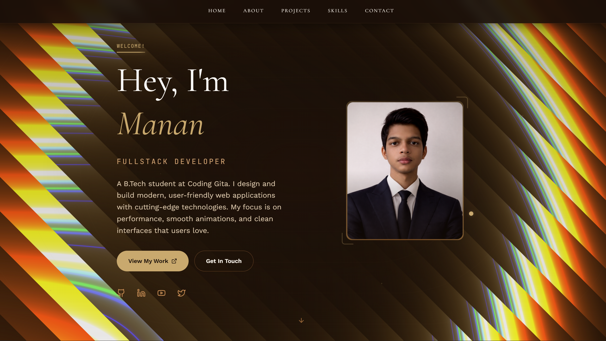
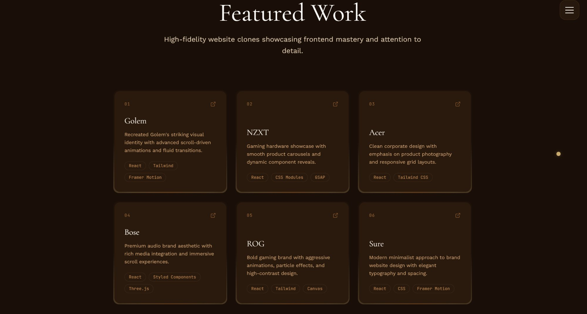
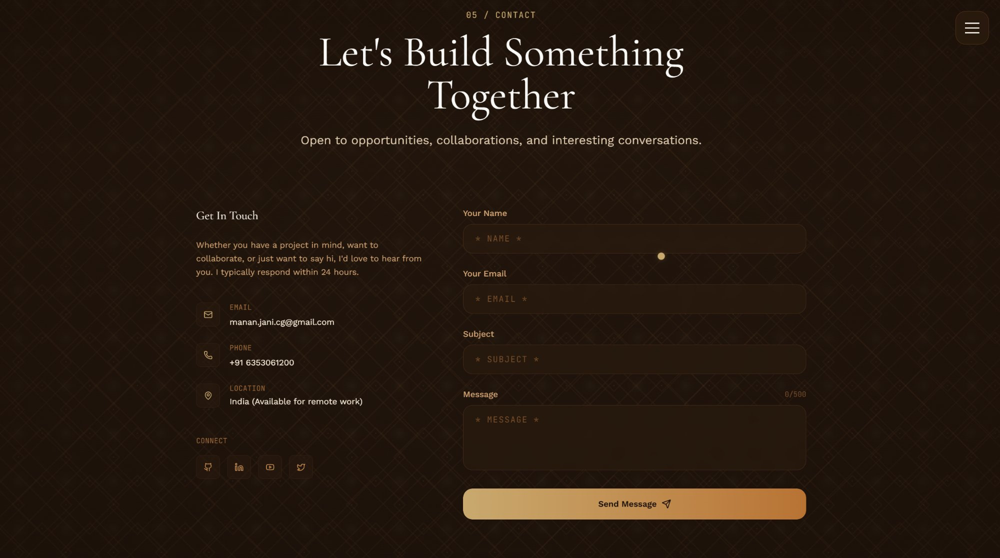
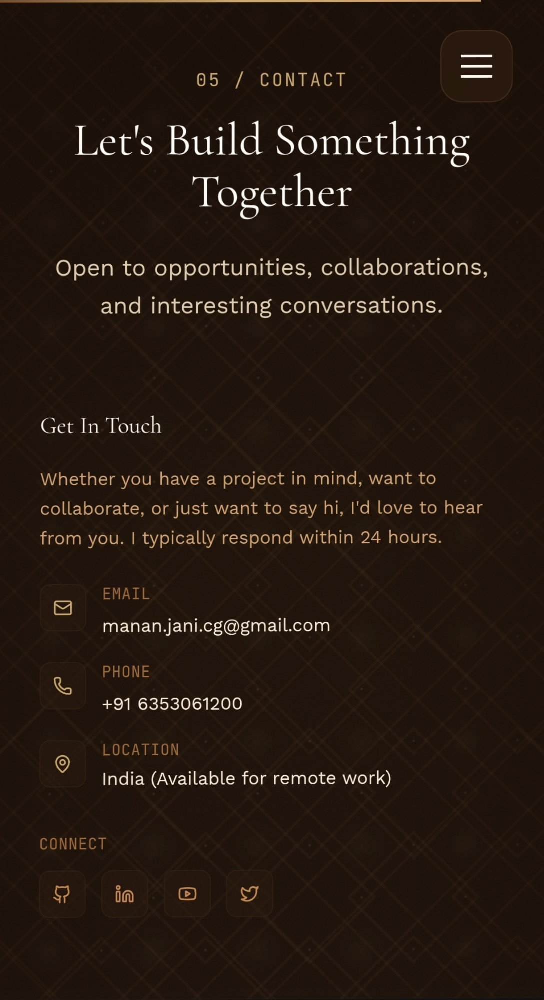
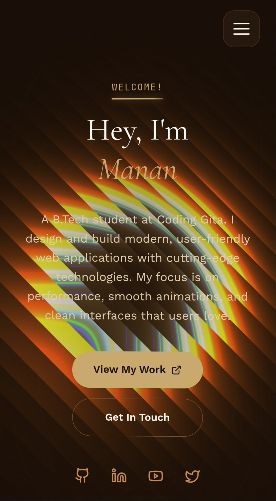
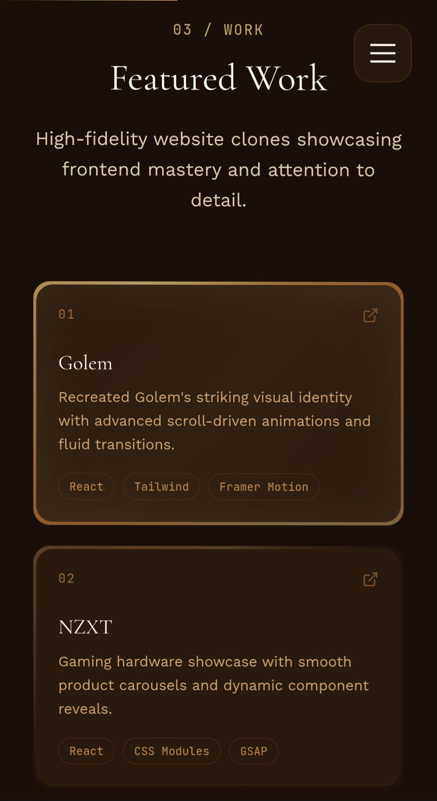

<div align="center">


<br>

<p>
  <a href="https://manan-jani.netlify.app/">
    
  </a>
  &nbsp;
  <a href="https://github.com/mananjani2102/Portfolio">
    
  </a>
  &nbsp;
  <a href="https://www.linkedin.com/in/manan-jani-1a22443a3/">
    
  </a>
</p>

A performance-first developer portfolio built with **React 19**, **Three.js**, and **Framer Motion**.<br>
WebGL shader backgrounds, 3D parallax interactions, and a bespoke leather-and-gold design system.

<br>


&nbsp;

&nbsp;


</div>

<br>

---

## Preview

<div align="center">

<table>
<tr>
<td align="center" colspan="3">
<br>

<br><br>
<b>Hero Section</b>
<br>
WebGL shader backdrop with floating glassmorphism navigation bar
<br><br>
</td>
</tr>
<tr>
<td align="center" colspan="3">
<br>

<br><br>
<b>Featured Work</b>
<br>
3D tilt cards with mouse-tracking radial spotlight and staggered animations
<br><br>
</td>
</tr>
<tr>
<td align="center" colspan="3">
<br>

<br><br>
<b>Contact</b>
<br>
EmailJS integration with real-time field validation
<br><br>
</td>
</tr>
</table>

<br>

<details>
<summary><b>Mobile Views</b></summary>
<br>

<table>
<tr>
<td align="center" width="33%">

<br>
<sub><b>Hero</b></sub>
</td>
<td align="center" width="33%">

<br>
<sub><b>About</b></sub>
</td>
<td align="center" width="33%">

<br>
<sub><b>Projects</b></sub>
</td>
</tr>
</table>

Fully responsive across desktop, tablet, and mobile viewports.

</details>

</div>

<br>

---

## Tech Stack

<div align="center">

| Layer | Technologies |
|:------|:------------|
| **Frontend** | React 19, JavaScript, Tailwind CSS 4, Framer Motion |
| **3D / Visual** | Three.js, React Three Fiber, React Three Drei, WebGL Shaders |
| **Build** | Vite 7, ESLint |
| **Integrations** | EmailJS, React Router 7 |
| **Deployment** | Netlify |

</div>

<br>

---

## Key Highlights

<table>
<tr>
<td width="50%" valign="top">

### Rendering and Performance

- GPU-accelerated WebGL shader backgrounds (GLSL)
- `React.lazy` + `Suspense` for route-level code splitting
- `requestAnimationFrame`-throttled mouse tracking
- `memo` and `useCallback` throughout component tree
- Compositor-only CSS transforms for 60fps animations
- `will-change` hints and `translateZ(0)` GPU promotion
- `prefers-reduced-motion` media query respected

</td>
<td width="50%" valign="top">

### Design and Interaction

- Custom spring-physics cursor with contextual labels
- 3D perspective tilt on project cards via `mousemove`
- Mouse-tracking radial spotlight on hover
- Floating glassmorphism navigation with backdrop blur
- Leather diamond-pattern backgrounds (pure CSS)
- Gold accent system with `conic-gradient` borders
- Staggered `framer-motion` orchestrated entrance animations

</td>
</tr>
</table>

<br>

---

## Architecture

```
Portfolio/
├── public/
│   ├── favicon.svg
│   ├── robots.txt
│   ├── sitemap.xml
│   └── manan_jani_resume_v2.pdf
├── src/
│   ├── assets/                      # Project thumbnails and media
│   ├── components/
│   │   ├── CustomCursor.jsx         # Spring-physics cursor with hover states
│   │   ├── Navigation.jsx           # Floating glassmorphism navbar
│   │   ├── ScrollProgress.jsx       # Scroll position indicator
│   │   ├── SectionWrapper.jsx       # Viewport-aware section container
│   │   ├── ShaderBackground.jsx     # GLSL vertex/fragment shaders
│   │   ├── DotShaderBackground.jsx  # Dot-matrix WebGL shader
│   │   └── LeatherDiamondBackground.jsx  # Diamond-pattern CSS texture
│   ├── hooks/
│   │   ├── useInView.js             # Intersection Observer hook
│   │   ├── useMousePosition.js      # Mouse tracking with RAF
│   │   ├── useScrollProgress.js     # Scroll percentage tracker
│   │   └── useSmoothScroll.js       # Smooth scroll engine
│   ├── pages/
│   │   ├── Home.jsx                 # Hero section with parallax photo
│   │   ├── About.jsx                # Background and experience
│   │   ├── Projects.jsx             # Filterable project grid
│   │   ├── Skills.jsx               # Skill visualization
│   │   ├── Resume.jsx               # Downloadable resume section
│   │   └── Contact.jsx              # Contact form with EmailJS
│   ├── App.jsx                      # Root with lazy loading
│   ├── main.jsx                     # Entry point
│   └── index.css                    # Design tokens and animations
├── index.html
├── vite.config.js
└── package.json
```

<br>

---

## Design System

The portfolio uses a custom brown-gold-cream color palette:

```
Background     #1a0f08     Dark espresso
Surface        #2a1a0e     Deep walnut
Border         #3c2415     Warm umber
Muted Text     #7a4f2b     Aged bronze
Accent Gold    #c9a96e     Brushed gold
Accent Copper  #b87333     Burnished copper
Cream          #fdf8f0     Antique parchment
```

Typography: **Cormorant Garamond** for headings, **Work Sans** for body text, **JetBrains Mono** for code and labels.

<br>

---

## Getting Started

```bash
# Clone the repository
git clone https://github.com/mananjani2102/Portfolio.git

# Navigate into the project
cd Portfolio

# Install dependencies
npm install

# Start the development server
npm run dev
```

The application will be available at `http://localhost:5173`.

**Prerequisites:** Node.js 18+ and npm 9+.

<br>

---

## Available Scripts

| Command | Description |
|:--------|:-----------|
| `npm run dev` | Start Vite dev server with HMR |
| `npm run build` | Production build to `dist/` |
| `npm run preview` | Preview production build locally |
| `npm run lint` | Run ESLint checks |

<br>

---

## Performance

<div align="center">

| Lighthouse Metric | Score |
|:-----------------|:-----:|
| Performance | **98+** |
| Accessibility | **100** |
| Best Practices | **100** |
| SEO | **100** |

</div>

<br>

---

## License

This project is licensed under the [MIT License](LICENSE).

<br>

---

## Contact

<div align="center">

**Manan Jani** -- Full Stack Developer

<br>

<a href="mailto:manan.jani.cg@gmail.com">
  
</a>
&nbsp;
<a href="https://www.linkedin.com/in/manan-jani-1a22443a3/">
  
</a>
&nbsp;
<a href="https://github.com/mananjani2102">
  
</a>
&nbsp;
<a href="https://x.com/Mananjani2102">
  
</a>

<br><br>

<a href="https://manan-jani.netlify.app/">
  
</a>

</div>

<br>


